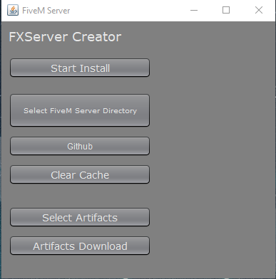
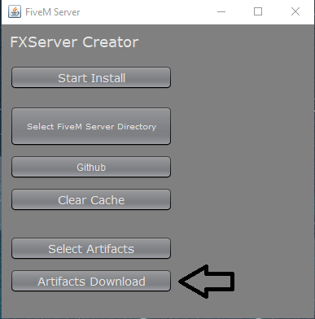
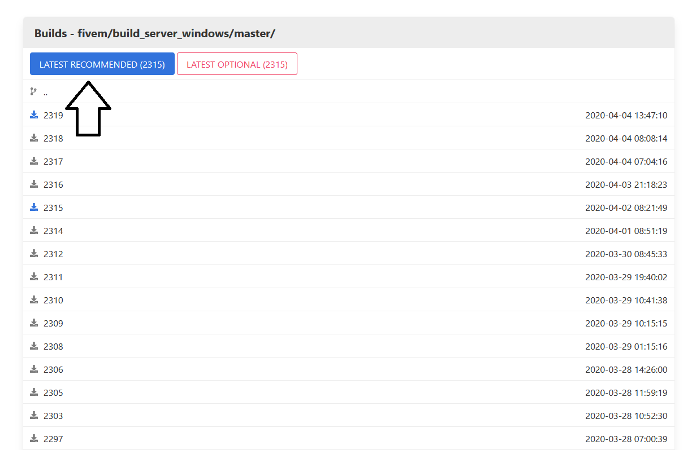
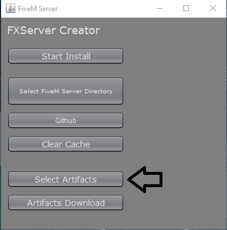
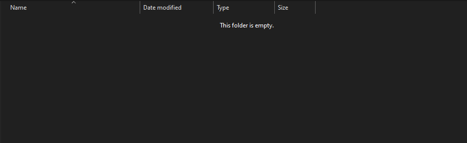
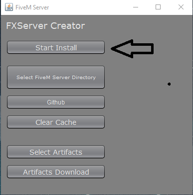

# FiveM Server Creator (FXS)
> The program which is made in Java automatically sets up your FiveM server.

## (https://www.youtube.com/watch?v=CZtDyq7VCTg "Youtube Tutorial")

## Installation

Windows:

1. Go to releases
2. Click download
3. Unzip the zip file and extract the folder inside to your desktop
4. Doubleclick the JAR file,if it doesnt want to open use the bat file provided

## Usage

1. Open it

2. Click the "Artifacts Download" Button

3. Click Latest Recommended

4. Locate the server.zip you downloaded and select it

5. Select your FiveM Server Directory (NO SPACES)

6. Click "Start Install"

7. Enter your license key from keymaster.fivem.net

8. Start the server with starter.bat

## Release History

* 1.0.0
    * Original code

* 1.0.1
    * Added a close operation
    
* 1.0.2
    * Adjusted file structure
    
* 1.0.3
    * Fixed download issues

## Meta

Cewiko1x – cewiko1x#3856

[https://github.com/cewiko1x](https://github.com/cewiko1x/)

<!-- Markdown link & img dfn's -->
[npm-image]: https://img.shields.io/npm/v/datadog-metrics.svg?style=flat-square
[npm-url]: https://npmjs.org/package/datadog-metrics
[npm-downloads]: https://img.shields.io/npm/dm/datadog-metrics.svg?style=flat-square
[travis-image]: https://img.shields.io/travis/dbader/node-datadog-metrics/master.svg?style=flat-square
[travis-url]: https://travis-ci.org/dbader/node-datadog-metrics
[wiki]: https://github.com/yourname/yourproject/wiki
