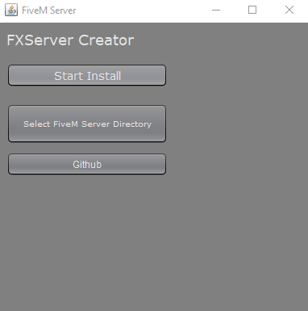
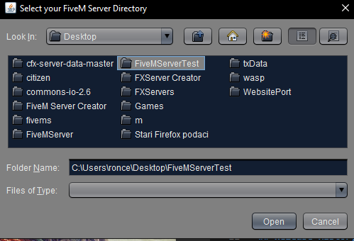

# FiveM Server Creator
> The program which is made in Java automatically sets up your FiveM server.

Images:

## Installation

Windows:

1. Go to releases
2. Click download
3. Unzip the zip file and extract the folder inside to your desktop
4. Doubleclick the JAR file,if it doesnt want to open use the bat file provided

## Usage

1. Open it

2. Select where you want the Server directory to be (folder)

3. Make sure the directory you want to use is empty

4. Click the start install button and wait around 10 seconds

5. Enter your license from keymaster.fivem.net and your done.

6. Start the server

## Release History

* 1.0.0
    * Original code

## Meta

Cewiko1x – cewiko1x#3856

[https://github.com/yourname/cewiko1x](https://github.com/cewiko1x/)

<!-- Markdown link & img dfn's -->
[npm-image]: https://img.shields.io/npm/v/datadog-metrics.svg?style=flat-square
[npm-url]: https://npmjs.org/package/datadog-metrics
[npm-downloads]: https://img.shields.io/npm/dm/datadog-metrics.svg?style=flat-square
[travis-image]: https://img.shields.io/travis/dbader/node-datadog-metrics/master.svg?style=flat-square
[travis-url]: https://travis-ci.org/dbader/node-datadog-metrics
[wiki]: https://github.com/yourname/yourproject/wiki
